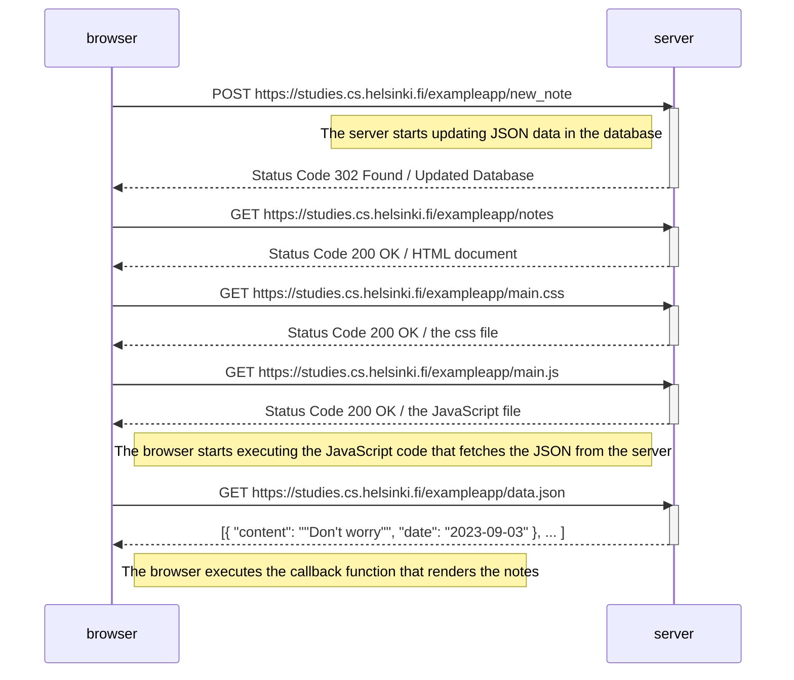

#0.4_New_note_diagram

```mermaid
sequenceDiagram

    browser->>server: POST https://studies.cs.helsinki.fi/exampleapp/new_note
    activate server
    Note left of server: The server starts updating JSON data in the database
    server-->>browser: Status Code 302 Found / Updated Database
    deactivate server

    browser->>server: GET https://studies.cs.helsinki.fi/exampleapp/notes
    activate server
    server-->>browser: Status Code 200 OK / HTML document
    deactivate server

    browser->>server: GET https://studies.cs.helsinki.fi/exampleapp/main.css
    activate server
    server-->>browser: Status Code 200 OK / the css file
    deactivate server

    browser->>server: GET https://studies.cs.helsinki.fi/exampleapp/main.js
    activate server
    server-->>browser: Status Code 200 OK / the JavaScript file
    deactivate server

    Note right of browser: The browser starts executing the JavaScript code that fetches the JSON from the server

    browser->>server: GET https://studies.cs.helsinki.fi/exampleapp/data.json
    activate server
    server-->>browser: [{ "content": ""Don't worry"", "date": "2023-09-03" }, ... ]
    deactivate server

    Note right of browser: The browser executes the callback function that renders the notes

```
